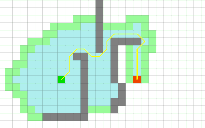

# Pathfinding

!!! note
    I took opportunity of that project to learn about many different optimization algorithms. 
    And indeed to create traffic flow simulations, we need pathfinding algorithms running fast in the background. 
    Learn more about how pathfinding was implemented in Westworld.

## Algorithms
Options are Djikstra, A*, flood filling, Voronoi diagrams, D*

## Resources
### Articles
- [Pathfinding detailed walkthrough and course](http://theory.stanford.edu/~amitp/GameProgramming/AStarComparison.html) - and [many other resources](http://theory.stanford.edu/~amitp/GameProgramming/) by Amit Patel
- [A* walkthrough](http://csis.pace.edu/~benjamin/teaching/cs627/webfiles/Astar.pdf) by Patrick Lester
- [Easy A* pathfinding](https://medium.com/@nicholas.w.swift/easy-a-star-pathfinding-7e6689c7f7b2) by Nicolas Swift and [improvements](https://gist.github.com/ryancollingwood/32446307e976a11a1185a5394d6657bc) by Ryan Collinwood
- [Pathfinding explained in Python](https://www.codementor.io/blog/basic-pathfinding-explained-with-python-5pil8767c1)
- [Complete wikipedia page](https://en.wikipedia.org/wiki/Pathfinding)
    