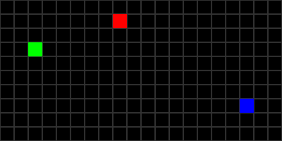

# Movements

For each step in the simulation, the environment will calculate what happens to every non-stationary objects binded to it. 
In particular, the agents who will probably move between t and t+1. 

If you can subclass the ``step()`` function for any custom movements. There are already many pre-coded functions to make your agent move. 

We will need the basic westworld imports for this tutorial
```python
from westworld.environment import GridEnvironment
from westworld.agents import BaseAgent
from westworld.simulation import Simulation
from westworld.colors import BLUE,GREEN,RED
```

## Random Walk
The most simple move there is: taking a random step. 

As you can see, you simply subclass the ``BaseAgent``, setup a random walk in one line of code and add it to the environment  

```python
class Agent(BaseAgent):
    def step(self):
        self.random_walk()
        
# Define all agents     
agent1 = Agent(2,3,curiosity=5,color = GREEN)
agent2 = Agent(17,7,curiosity=2,color = BLUE)
agent3 = Agent(8,1,curiosity=20,color = RED)

# Define environment
env = GridEnvironment(width = 20,height = 10,cell_size = 20,show_grid = True)

# Add agents to the environment
env.add_object([agent1,agent2,agent3])
env.render()

# Make simulation
sim = Simulation(env,fps = 10,name="RandomWalk")
_,_ = sim.run_episode(n_steps = 20,save = True,replay = True,save_format="gif")
```


## Wandering
If you need an agent to explore the environment, you can use the ``.wander()`` function. 
Basically the agent will walk straight in a direction, and change direction at some point using a ``curiosity`` factor - ie for ``curiosity = 5`` it will change direction every 5 steps (in the example below, compare the behavior of the 3 agents with a different curiosity). 

In a ``GridEnvironment``, the direction angle is approximated by sampling horizontal and vertical movements on the grid to match the angle as best as possible.

```python
class Agent(BaseAgent):
    def step(self):
        self.wander()
```


## Pathfinding
Another useful behavior is moving towards a point. This is done using pathfinding algorithms. 

If there are some obstacles, you may require advanced pathfinding (tutorial to come) which is more expensive to compute. Without obstacles you can use naive pathfinding. 

Just use the ``.move_towards()`` function and your agents will move towards a given target

```python
class Agent(BaseAgent):
    def step(self):
        self.move_towards(0,0,naive = True)
```

