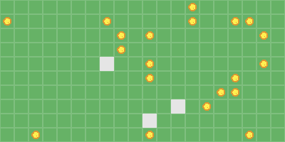

# Quickstart

Getting started with ``westworld`` in a few lines of code - Westworld is multi-agent simulation library in Python. You can use it to simulate spatial environments with agents moving, interacting with each other, finding their path and avoiding obstacles, ...

In this quickstart, we will create a super simple ecosystem of rabbits competing and looking for food and eating them when they find it. 




## Preparing the basic imports
We will import necessary objects classes, the environment and simulation wrappers. 
```python
from westworld.environment import GridEnvironment
from westworld.agents import BaseAgent
from westworld.objects import BaseCollectible
from westworld.simulation import Simulation
```
## Defining the food to collect
Objects that are collected by agents and then disappear are called ``Collectibles``. They can trigger something once an agent collects them and then are destroyed. We will then subclass this Collectible class to create our Food object. 
```python
class Food(BaseCollectible):
    pass
```
Yes this class does nothing. For now. Actually we will just use the name of the class ``Food`` in the Rabbit behavior function to look for those collectibles. Of course we could add more features to this collectible, for example increase the life of the rabbit once eaten. 


## Defining the rabbits
We will then define a rabbit whose behavior will be described in a ``.step()`` function - ie everything that happens between t and t+1

- Looking for the closest food piece using helper function ``.find_closest()`` (we will use the class name here to find for the ``Food`` objects)
- If it finds any, the rabbit will move towards the object to collect it using ``.move_towards()`` helper function until collecting it and going to the next closest
- If there aren't anymore food, the rabbit will just ``.wander()`` around the environment


```python
class Rabbit(BaseAgent):
    
    def __init__(self,x,y):
        super().__init__(x,y,color = (229, 229, 229),curiosity = 5)
    
    def step(self):
        
        # Find closest food
        targets = self.find_closest(name = "Food",k = 1)
        
        # If there is still food, move towards the food
        if len(targets) > 0:
            
            target = targets[0]
            
            # Use naive pathfinding for faster computation as there is no obstacle
            self.move_towards(obj = target,naive = True)
            
        # Otherwise just wandering
        # Changing direction every n steps where n = curiosity
        else:
            self.wander()
```

## Preparing spawners
Spawners will help us add multiple rabbits and food pieces at the same time, it's a generator of custom objects in your environment. 
We will simply use a lambda function:

```
rabbit_spawner = lambda x,y : Rabbit(x,y)
food_spawner = lambda x,y : Food(x,y,color = (220,150,50),img_asset = "ball")
```

For the Food object we use default arguments of ``BaseCollectible`` objects to change the food color and shape (make it look like a ball).

## Defining the environment
Now we need to put those food and rabbits somewhere, let's create a grid environment. There are many arguments to define width, height, cell size, colors, etc...
```python
env = GridEnvironment(20,10,20,show_grid = True,background_color=(102, 178, 102),grid_color=(127, 191, 127),toroidal=True)
```

We now add a few rabbits and food pieces using the spawner. 
```python
env.spawn(rabbit_spawner,3)
env.spawn(food_spawner,20)
```

And we initalize the environment and visualize it using ``.render()`` function
```python
env.render()
```

## Launching the simulation
Next step is to simulate what happens in the environment with the step rules that we defined. We now wrap the environment in a ``Simulation`` object and run an episode of 50 steps. We save the simulation to a gif to be visualized. 

```python
sim = Simulation(env,fps = 10,name="Quickstart")
_,_ = sim.run_episode(n_steps = 50,save = True,replay = True,save_format="gif",)
```

We get the following simulation:


## Going further
There are so many behaviors you can customize using precoded functions in westworld or write your own, you can add obstacles, put the agents in a maze, define other agents, complexify agent behavior, log information over time. You are not even obliged to use a grid environment and can work in a continuous environment.

For this ecosystem simulation, there are also many improvements you can do: add rabbit reproduction, short sightedness, introduce predators or different type of food. We will see a more complex example in another tutorial.
